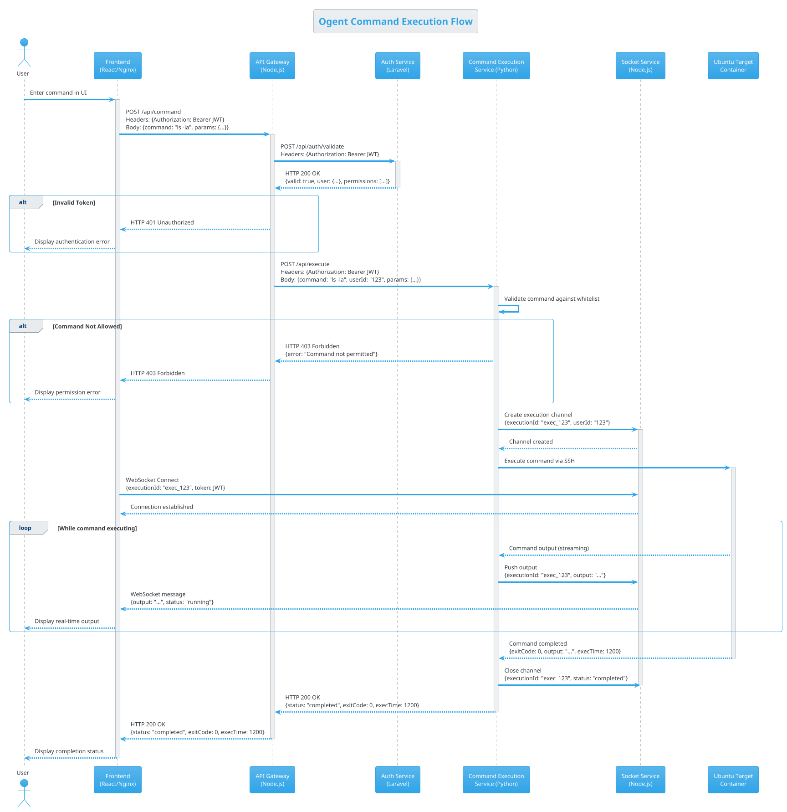

# Command Execution Flow (PlantUML Format)

This detailed sequence diagram shows the complete flow of a command execution in the Ogent platform, including HTTP methods, headers, payload formats, and error handling paths. The diagram helps visualize how the different services interact during command execution and how data flows through the system. 